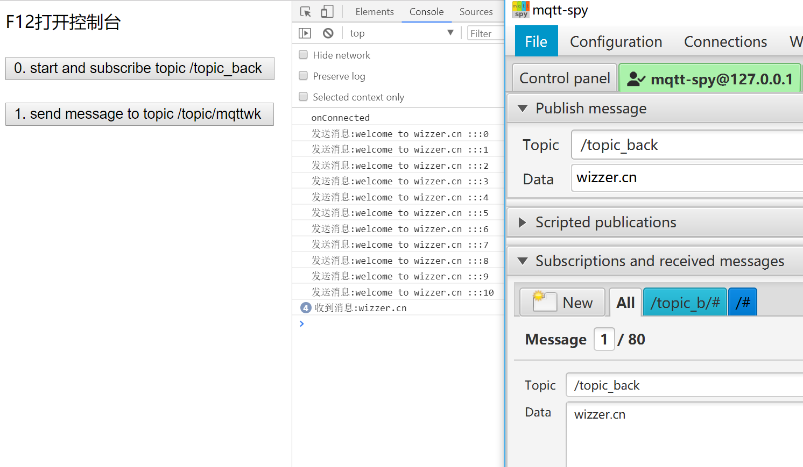

<div align="center">
    <br/>
    <h1>MqttWk - by netty</h1>

[](https://github.com/Wizzercn/MqttWk/releases)
[](https://www.apache.org/licenses/LICENSE-2.0.html)
[](https://github.com/nutzam/nutzboot)
</div>

<div align="center">

**[官网](https://budwk.com)** |
**[捐赠清单](https://budwk.com/donation)**

</div>


> 本项目开源免费，欢迎交流学习、贡献代码。

#### MqttWk
* QQ群号：225991747

#### BudWk

* 微服务分布式 + 前后端分离开发框架
* 演示地址：[https://demo.budwk.com](https://demo.budwk.com)
* Github：[https://github.com/budwk/budwk](https://github.com/budwk/budwk)
* Gitee：[https://gitee.com/budwk/budwk](https://gitee.com/budwk/budwk)
* QQ群号：24457628

# 开发指南

#### 技术体系

1. 使用 netty 实现通信及协议解析
2. 使用 nutzboot 提供依赖注入及属性配置
3. 使用 redis 实现消息缓存,集群
4. 使用 kafka 实现消息代理(可选)

#### 项目结构
```
MqttWk
  ├── mqtt-auth -- MQTT服务连接时用户名和密码认证
  ├── mqtt-broker -- MQTT服务器功能的核心实现
  ├── mqtt-common -- 公共类及其他模块使用的服务接口及对象
  ├── mqtt-store -- MQTT服务器会话信息(redis缓存及kafka加载)
  ├── mqtt-client -- MQTT客户端示例代码(配置文件修改数据库连接启动之)
  ├── mqtt-zoo -- 教程文档或文件
    ├── mqtt-test-kafka -- kafka消费者接收消息
    ├── mqtt-test-websocket -- websocket通信测试示例
```

#### 功能说明
1. 参考MQTT3.1.1规范实现
2. 完整的QoS服务质量等级实现
3. 遗嘱消息, 保留消息及消息分发重试
4. 心跳机制
5. MQTT连接认证(可选择是否开启)
6. SSL方式连接(可选择是否开启)
7. 主题过滤(支持单主题订阅如 `test_topic`  `/mqtt/test` --不能以/结尾, 通配符订阅 `#` `/mqtt/#` --以#结尾)
8. Websocket支持(可选择是否开启)
9. 集群功能(可选择是否开启)
10. Kafka消息转发功能(可选择是否开启)
11. 启动后查看统计数据 `http://127.0.0.1:8922/open/api/mqttwk/info`

#### 快速开始
- JDK1.8
- 项目根目录执行  `mvn install` 
- mqtt-broker 下执行 `mvn clean package nutzboot:shade` 进行打包
- 运行并加载jar内部yaml配置文件 `java -jar mqtt-broker-xxx.jar -Dnutz.profiles.active=prod` [此时加载application-prod.yaml配置文件]
- 部署并加载指定文件夹下yaml配置文件 `nohup java -Dnutz.boot.configure.yaml.dir=/data -jar mqtt-broker-xxx.jar >/dev/null 2>&1 & `
- 打开mqtt-spy客户端, 填写相应配置[下载](https://github.com/eclipse/paho.mqtt-spy/wiki/Downloads)
- 连接端口: 8885, websocket 端口: 9995 websocket
- 连接使用的用户名: demo
- 连接使用的密码: 8F3B8DE2FDC8BD3D792BE77EAC412010971765E5BDD6C499ADCEE840CE441BDEF17E30684BD95CA708F55022222CC6161D0D23C2DFCB12F8AC998F59E7213393
- 连接使用的证书在 `mqtt-zoo`\keystore\server.cer

#### 集群使用
- 多机环境集群:

```yaml
mqttwk:
  broker:
    cluster-on: true
    kafka:
      # 是否启用kafka消息转发
      broker-enabled: false
      bootstrap:
        servers: 192.168.1.101:9092,192.168.1.102:9093
redis:
  mode: cluster
  nodes: 192.168.1.103:16379,192.168.1.104:26379,192.168.1.103:36379
```
- 单机环境集群: 

```yaml
mqttwk:
  broker:
    cluster-on: true
    kafka:
      # 是否启用kafka消息转发
      broker-enabled: false
      bootstrap:
        servers: 192.168.1.101:9092,192.168.1.102:9093
redis:
  mode: normal
  host: 127.0.0.1
  port: 6379
```

#### 自定义 - 连接认证
- 默认只是简单使用对用户名进行RSA密钥对加密生成密码, 连接认证时对密码进行解密和相应用户名进行匹配认证
- 使用中如果需要实现连接数据库或其他方式进行连接认证, 只需要重写`mqtt-auth`模块下的相应方法即可

#### 自定义 - 服务端证书
- 服务端证书存储在`mqtt-broker`的`resources/keystore/server.pfx`
- 用户可以制作自己的证书, 但存储位置和文件名必须使用上述描述的位置及文件名

#### 生产环境部署
- 多机环境集群
- 负载均衡: 富人用 L4 Switch,穷人用 Linux HAProxy

#### 示例截图



# 参考项目

* [https://github.com/netty/netty](https://github.com/netty/netty)
* [https://gitee.com/recallcode/iot-mqtt-server](https://gitee.com/recallcode/iot-mqtt-server)

> 如果您觉得还不错请在右上角点一下 star，帮忙转发，谢谢 🙏🙏🙏 大家的支持是开源最大动力
