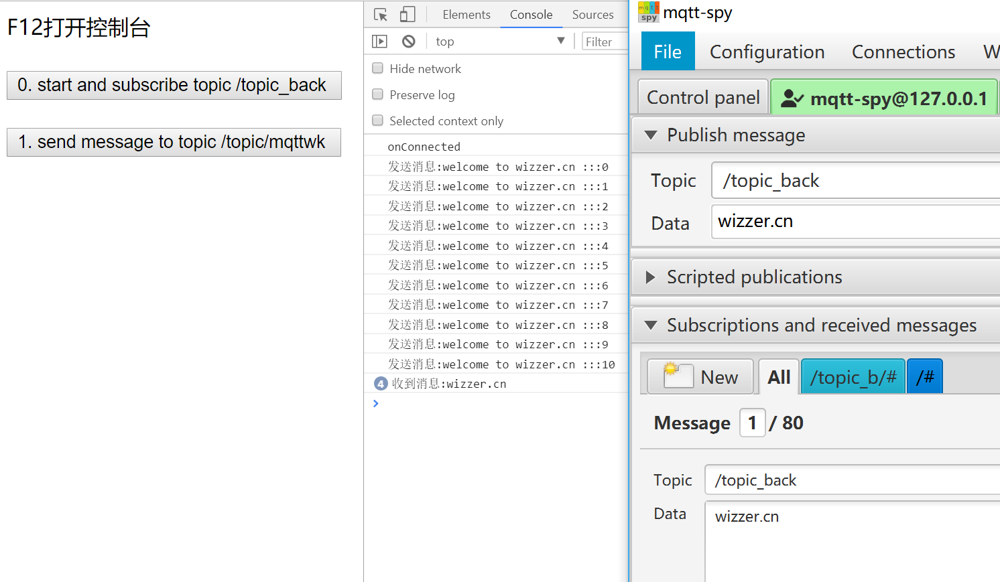

<div align="center">
    <br/>
    <h1>MqttWk - powered by netty</h1>

[](https://github.com/Wizzercn/MqttWk/releases)
[](https://www.apache.org/licenses/LICENSE-2.0.html)
[](https://github.com/nutzam/nutzboot)
</div>

[中文](README.md) | English

> This project is open source and free. Welcome to exchange, learn, and contribute code.

#### MqttWk
* QQ Group: 225991747

# Development Guide

#### Technology Stack

1. Using netty for communication and protocol parsing
2. Using nutzboot for dependency injection and property configuration
3. Using redis for message caching and clustering
4. Using kafka for message forwarding (optional)

#### Project Structure
```
MqttWk
  ├── mqtt-auth -- MQTT service username and password authentication
  ├── mqtt-broker -- Core implementation of MQTT server functionality
  ├── mqtt-common -- Common classes and service interfaces used by other modules
  ├── mqtt-store -- MQTT server session information (redis cache and kafka loading)
  ├── mqtt-client -- MQTT client example code (modify database connection in config file to start)
  ├── mqtt-zoo -- Tutorials, documents, or files
    ├── mqtt-test-kafka -- Kafka consumer for receiving messages
    ├── mqtt-test-websocket -- Websocket communication test example
```

#### Features
1. Implemented according to MQTT 3.1.1 specification
2. Complete QoS service quality level implementation
3. Last will messages, retained messages, and message distribution retry
4. Heartbeat mechanism
5. MQTT connection authentication (optional)
6. SSL connection (optional)
7. Topic filtering (supports single topic subscription like `test_topic` or `/mqtt/test` --cannot end with /, wildcard subscription `#` or `/mqtt/#` --must end with #)
8. Websocket support (optional)
9. Clustering functionality (optional)
10. Kafka message forwarding (optional)
11. View statistics after startup at `http://127.0.0.1:8922/open/api/mqttwk/info`

#### Quick Start
- JDK 1.8
- Execute `mvn install` in the project root directory
- Execute `mvn clean package nutzboot:shade` in mqtt-broker for packaging
- Run and load internal yaml configuration file: `java -jar mqtt-broker-xxx.jar -Dnutz.profiles.active=prod` [This loads the application-prod.yaml configuration file]
- Deploy and load yaml configuration file from a specified folder: `nohup java -Dnutz.boot.configure.yaml.dir=/data -jar mqtt-broker-xxx.jar >/dev/null 2>&1 &`
- Open mqtt-spy client and fill in the corresponding configuration [Download](https://github.com/eclipse/paho.mqtt-spy/wiki/Downloads)
- Connection port: 8885, websocket port: 9995
- Username for connection: demo
- Password for connection: 8F3B8DE2FDC8BD3D792BE77EAC412010971765E5BDD6C499ADCEE840CE441BDEF17E30684BD95CA708F55022222CC6161D0D23C2DFCB12F8AC998F59E7213393
- The certificate used for connection is in `mqtt-zoo`\keystore\server.cer

#### Cluster Usage
- Multi-machine environment cluster:

```yaml
mqttwk:
  broker:
    cluster-on: true
    kafka:
      # Whether to enable kafka message forwarding
      broker-enabled: false
      bootstrap:
        servers: 192.168.1.101:9092,192.168.1.102:9093
redis:
  mode: cluster
  nodes: 192.168.1.103:16379,192.168.1.104:26379,192.168.1.103:36379
```
- Single machine environment cluster:

```yaml
mqttwk:
  broker:
    cluster-on: true
    kafka:
      # Whether to enable kafka message forwarding
      broker-enabled: false
      bootstrap:
        servers: 192.168.1.101:9092,192.168.1.102:9093
redis:
  mode: normal
  host: 127.0.0.1
  port: 6379
```

#### Customization - Connection Authentication
- By default, it simply uses RSA key pair encryption on the username to generate a password, and decrypts the password during connection authentication to match with the corresponding username
- If you need to implement connection authentication using a database or other methods, you only need to override the corresponding methods in the `mqtt-auth` module

#### Customization - Server Certificate
- The server certificate is stored in `mqtt-broker`'s `resources/keystore/server.pfx`
- Users can create their own certificates, but the storage location and filename must be as described above

#### Production Environment Deployment
- Multi-machine environment cluster
- Load balancing: Rich people use L4 Switch, poor people use Linux HAProxy

#### Example Screenshot



# Reference Projects

* [https://github.com/netty/netty](https://github.com/netty/netty)
* [https://gitee.com/recallcode/iot-mqtt-server](https://gitee.com/recallcode/iot-mqtt-server)

> If you find this project helpful, please give it a star in the upper right corner and help spread the word. Thank you 🙏🙏🙏 Your support is the biggest motivation for open source 